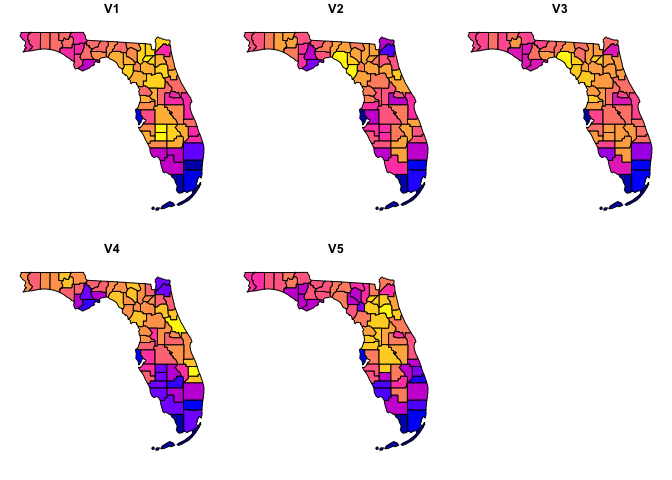
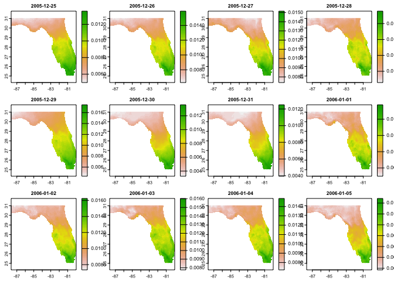

<!-- README.md is generated from README.Rmd. Please edit that file -->

# opendap.catalog

<!-- badges: start -->

[](#)
[](https://choosealicense.com/licenses/mit/)
[](https://github.com/mikejohnson51/opendap.catalog/actions/workflows/pkgdown.yaml)
[](https://lifecycle.r-lib.org/articles/stages.html#experimental)
[](https://github.com/mikejohnson51/opendap.catalog/actions/workflows/R-CMD-check.yaml)
<!-- badges: end -->

# TL:DR;

`opendapR` provides a generalized inter functions needed to find, and
document, the information needed to identify and form OpenDap queries
for a range of resources.

## Terminolgy

OPeNDAP is a framework that simplifies scientific data networking via
software that makes local data accessible to remote locations. [see
here](https://www.opendap.org)

For example a large NetCDF file of gridmet data can sit on the
Northwestern computing system and users - like us - can request subsets
of data from that file!

Large local files can be published to a web-based **T**HREDDS **D**ata
**S**erver from which metadata and data can be accessed using OPeNDAP,
OGC WCS, HTTP, and other data access protocols.

This allows users to stream the portion of the data set releavnat to
them!

## OpenDap Syntax

To request a subset from a TDS data using OpenDAP protocol, a common
form can be followed:

    URL?{varname}{Ymin:1:Ymax}{Xmin:1:Xmax}{Tmin:1:Tmax}

# Use Cases

Lets get data in some different ways for the state of Florida.

``` r
library(opendap.catalog)
library(terra)
#> terra 1.5.21
library(jsonlite)
#> Warning: package 'jsonlite' was built under R version 4.1.2
library(dplyr)
#> Warning: package 'dplyr' was built under R version 4.1.2
#> 
#> Attaching package: 'dplyr'
#> The following objects are masked from 'package:terra':
#> 
#>     intersect, src, union
#> The following objects are masked from 'package:stats':
#> 
#>     filter, lag
#> The following objects are masked from 'package:base':
#> 
#>     intersect, setdiff, setequal, union

AOI <- AOI::aoi_get(state = "FL", county = "all")
plot(AOI$geometry)
```


### Remote Resource

``` r
url <- "https://cida.usgs.gov/thredds/dodsC/bcsd_obs"

dap = dap_crop(URL = url, AOI = AOI, startDate = "1995-01-01")

dap.summary(dap)
#> vars:   > pr [mm/m] (monthly_sum_pr)
#>  > prate [mm/d] (monthly_avg_prate)
#>  > tas [C] (monthly_avg_tas)
#>  > tasmax [C] (monthly_avg_tasmax)
#>  > tasmin [C] (monthly_avg_tasmin)
#>  > wind [m/s] (monthly_avg_wind)
#> X:      62 (longitude)
#> Y:      48 (latitude)
#> T:      1 (time - 1 months)
#> values: 17,856 (vars*X*Y*T)

DT::datatable(dap)
```


``` r
bcsd = dap_get(dap = dap[dap$varname == "pr",])

plot(bcsd$pr)
```


## Local Resource

``` r
url <- '/Users/mjohnson/Downloads/NEXGDM_srad_2020_v100.nc'
utils:::format.object_size(file.size(url), "auto")
#> [1] "3.7 Gb"

system.time({
  dap = dap_crop(URL = url, AOI = AOI, 
                 startDate = "2020-01-01", endDate = "2020-01-05")
  nexgdm = dap_get(dap)
})
#> Warning in getGeoDatum(gm): Didn't find a longitude of prime meridian for datum,
#> assuming 0.
#> Warning in getGeoDatum(gm): Didn't find a semi major axis for datum, assuming
#> WGS84 6378137.0 meters
#> Warning in getGeoDatum(gm): Didn't find an inverse flattening value, assuming
#> WGS84 298.257223563
#>    user  system elapsed 
#>   0.984   0.105   1.215

dap.summary(dap)
#> vars:   > srad [MJ/day] (Shortwave radiation)
#> X:      807 (x)
#> Y:      693 (y)
#> T:      4 (time - 1 days)
#> values: 2,237,004 (vars*X*Y*T)

plot(nexgdm$srad)
```


## Remote Spatially tiled reosouces

### MODIS

``` r
cat <- read_json('cat_params.json', simplifyVector = TRUE)

##### Across Space
modis_ex = filter(cat, id == 'MOD16A2.006', varname == 'PET_500m')

dap = dap_crop(
    catolog = modis_ex,
    AOI = AOI,
    startDate = "2010-01-01",
    endDate = "2010-01-31"
  ) |>
    dap_get()

plot(dap)
```



## Remote Temportally tiled reources

``` r
maca_ex = filter(cat, id == 'maca_day', variable == 'huss', model == 'BNU-ESM',
                scenario %in% c("historical", 'rcp85')) 

dap = dap_crop(catolog = maca_ex, AOI = AOI, 
                   startDate = "2005-12-25", endDate = "2006-01-05") |> 
    dap_get()

plot(c(dap$specific_humidity_historical, dap$specific_humidity_rcp85))
```


``` r
nldas_ex = filter(cat, id == 'NLDAS_FORA0125_H.002', varname == 'apcpsfc') 

dap = dap_crop(catolog = nldas_ex, AOI = AOI, 
                   startDate = "2005-12-25", endDate = "2005-12-25") |> 
    dap_get()

plot(dap$apcpsfc_NA)
```



## NGEN focus?

### January ET for Florida counties

``` r
system.time({
 agg = zonal::execute_zonal(dap$apcpsfc_NA, AOI, "geoid")
})
#>    user  system elapsed 
#>   1.573   0.120   1.772

plot(agg[grep("V", names(agg))])
#> Warning: plotting the first 9 out of 24 attributes; use max.plot = 24 to plot
#> all
```


``` r
aggMax = zonal::execute_zonal(dap$apcpsfc_NA, AOI, "geoid", FUN = "max")

plot(aggMax[grep("V", names(aggMax))])
#> Warning: plotting the first 9 out of 24 attributes; use max.plot = 24 to plot
#> all
```


