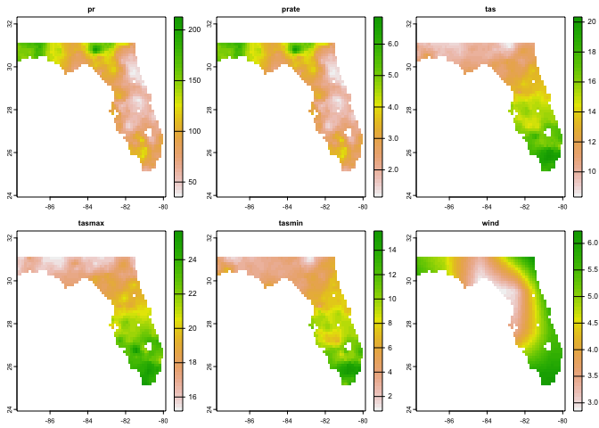
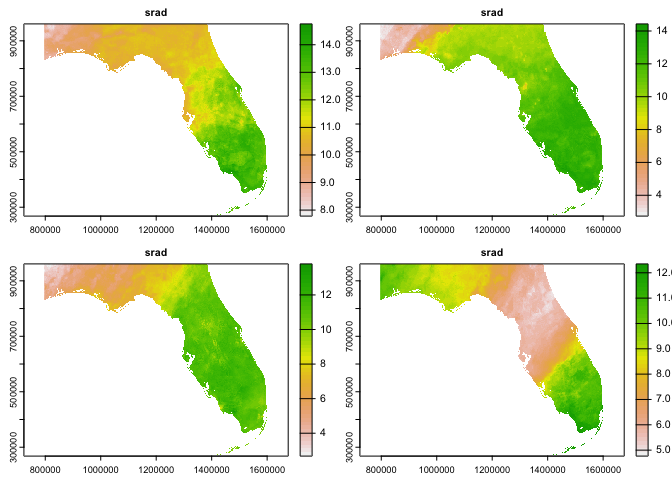

<!-- README.md is generated from README.Rmd. Please edit that file -->
<!-- badges: start -->

[](#)
[](https://choosealicense.com/licenses/mit/)
[](https://github.com/mikejohnson51/opendap.catalog/actions/workflows/pkgdown.yaml)
[](https://lifecycle.r-lib.org/articles/stages.html#experimental)
[](https://github.com/mikejohnson51/opendap.catalog/actions/workflows/R-CMD-check.yaml)
<!-- badges: end -->

<div id="top">

</div>

<br />

<div align="center">

<h3 align="center">
<strong>OpenDap</strong> Catalog
</h3>
<p align="center">
<a href="https://mikejohnson51.github.io/opendap.catalog/"><strong>«
Explore the Docs »</strong></a> <br /> <br />
<a href="https://mikejohnson51.github.io/opendap.catalog/cat_params.json">Data
Catalog</a> · <a href="">R Interface</a> ·
<a href="https://github.com/mikejohnson51/opendap.catalog/issues">Request
Feature</a>
</p>

</div>

<hr>

One of the biggest challenges with Earth System and spatial research is
extracting data. These challenges include not only finding the source
data but then downloading, managing, and extracting the partitions
critical for a given task.

Services exist to make data more readily available over the web but
introduce new challenges of identifying subsets, working across a wide
array of standards (e.g. non-standards), all without alleviating the
challenge of finding resources.

In light of this, `opendap.catolog` provides three primary services.

<hr>

#### 1. Generalized space (XY) and Time (T) subsets for *remote* and *local* NetCDF data with `dap()`

> remote

``` r
dap <- dap(URL = "https://cida.usgs.gov/thredds/dodsC/bcsd_obs", 
           AOI = AOI::aoi_get(state = "FL"), 
           startDate = "1995-01-01")

str(dap, max.level = 1)
#> List of 6
#>  $ pr    :Formal class 'SpatRaster' [package "terra"] with 1 slot
#>  $ prate :Formal class 'SpatRaster' [package "terra"] with 1 slot
#>  $ tas   :Formal class 'SpatRaster' [package "terra"] with 1 slot
#>  $ tasmax:Formal class 'SpatRaster' [package "terra"] with 1 slot
#>  $ tasmin:Formal class 'SpatRaster' [package "terra"] with 1 slot
#>  $ wind  :Formal class 'SpatRaster' [package "terra"] with 1 slot
```



> local

``` r
file <- '/Users/mjohnson/Downloads/NEXGDM_srad_2020_v100.nc'
utils:::format.object_size(file.size(file), "auto")
#> [1] "3.7 Gb"

dap = dap(URL = file, 
          AOI = AOI::aoi_get(state = "FL"), 
          startDate = "2020-01-01", endDate = "2020-01-05")
```



#### 2. A catalog of 7294 web resources (as of 02/2022)

``` r
dplyr::glimpse(opendap.catalog::params)
#> Rows: 7,294
#> Columns: 15
#> $ id        <chr> "maca_day", "maca_day", "maca_day", "maca_day", "maca_day", …
#> $ grid.id   <chr> "maca_day", "maca_day", "maca_day", "maca_day", "maca_day", …
#> $ URL       <chr> "http://thredds.northwestknowledge.net:8080/thredds/dodsC/ag…
#> $ tiled     <chr> "T", "T", "T", "T", "T", "T", "T", "T", "T", "T", "T", "T", …
#> $ variable  <chr> "huss", "huss", "huss", "huss", "huss", "huss", "huss", "hus…
#> $ varname   <chr> "specific_humidity", "specific_humidity", "specific_humidity…
#> $ long_name <chr> "Daily Mean Near-Surface Specific Humidity", "Daily Mean Nea…
#> $ units     <chr> "kg kg-1", "kg kg-1", "kg kg-1", "kg kg-1", "kg kg-1", "kg k…
#> $ model     <chr> "BNU-ESM", "CNRM-CM5", "CSIRO-Mk3-6-0", "bcc-csm1-1", "CanES…
#> $ ensemble  <chr> "r1i1p1", "r1i1p1", "r1i1p1", "r1i1p1", "r1i1p1", "r1i1p1", …
#> $ scenario  <chr> "historical", "historical", "historical", "historical", "his…
#> $ T_name    <chr> "time", "time", "time", "time", "time", "time", "time", "tim…
#> $ duration  <chr> "1950-01-01/2005-12-31", "1950-01-01/2005-12-31", "1950-01-0…
#> $ interval  <chr> "1 days", "1 days", "1 days", "1 days", "1 days", "1 days", …
#> $ nT        <int> 20454, 20454, 20454, 20454, 20454, 20454, 20454, 20454, 2045…
```

For use in other applications (e.g. [stars
proxy](https://github.com/r-spatial/stars/pull/499),
[geoknife](https://github.com/USGS-R/geoknife),
[climateR](https://github.com/mikejohnson51/climateR) or python/go/Rust
applciations) this catalog is available as a JSON artifact
[here](https://mikejohnson51.github.io/opendap.catalog/cat_params.json).

``` r
read_json('https://mikejohnson51.github.io/opendap.catalog/cat_params.json', 
          simplifyVector = TRUE)
```

### (3) The ability to pass catalog elements to the generalized toolsets:

``` r
# Find MODIS PET in Florida for January 2010
(
  dap = dap(
    catolog = dplyr::filter(params, 
                            id == 'MOD16A2.006', 
                            varname == 'PET_500m'),
    AOI = AOI::aoi_get(state = "FL"),
    startDate = "2010-01-01",
    endDate   = "2010-01-31"
  )
)
#> class       : SpatRaster 
#> dimensions  : 1561, 1336, 5  (nrow, ncol, nlyr)
#> resolution  : 463.3127, 463.3127  (x, y)
#> extent      : -8404261, -7785275, 2724047, 3447278  (xmin, xmax, ymin, ymax)
#> coord. ref. : +proj=sinu +lon_0=0 +x_0=0 +y_0=0 +R=6371007.181 +units=m +no_defs 
#> source      : memory 
#> names       : 2010-01-02, 2010-01-10, 2010-01-18, 2010-01-26, 2010-02-03 
#> min values  :  10.300000,   7.200000,   9.900001,   9.900001,  11.100000 
#> max values  :       34.4,       24.1,       35.9,       37.5,       44.4
```


